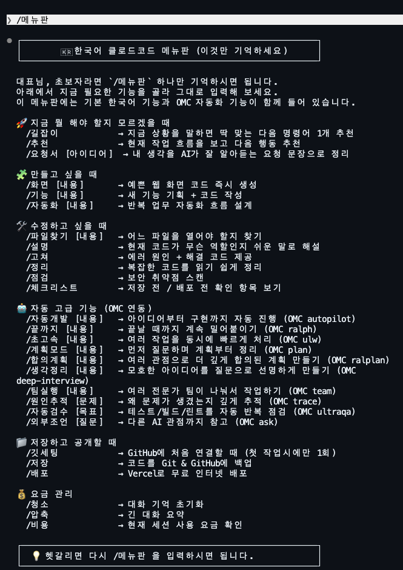

# CCO-K

권장 GitHub 저장소명은 `claude-code-omc-korean` 입니다.

CCO-K는 비전공자 맞춤 한국어 Claude Code + OMC 환경입니다.  
핵심 목표는 `/메뉴판` 하나만 기억해도 개발을 이어갈 수 있게 만드는 것입니다.

현재 버전: `0.1.0`



메뉴판 예시 화면입니다. 사용자는 Claude Code를 실행한 뒤 `/메뉴판` 만 입력하면 됩니다.

이 저장소는 기본 한국어 스킬에 더해 [OMC (Oh My ClaudeCode)](https://omc.vibetip.help/) 자동화 기능까지 함께 쓰도록 설계되어 있습니다.

## 한 줄 소개

- Claude Code를 한국어 메뉴형으로 쉽게 쓰고 싶은 비전공자용 플러그인
- `/메뉴판` 하나로 기본 작업과 OMC 자동화 모드를 함께 사용
- 아이디어 정리부터 구현, 수정, 배포 전 점검까지 한국어 흐름으로 연결

## 특징

- `/메뉴판` 하나로 주요 기능을 확인
- 한국어로 쉬운 설명, 요청서 정리, 파일 찾기, 에러 해결 지원
- OMC 연동으로 자동 개발, 원인 추적, 자동 검수, 외부 조언까지 확장
- `.omc` 폴더는 자동 기록/분석용으로 유지
- MIT License로 공개 가능

## 설치 방법

현재 CCO-K는 Claude Code 플러그인 형태로 배포할 수 있도록 구조를 갖췄습니다.

### 로컬 테스트 설치

1. 이 저장소를 원하는 위치에 내려받습니다.
2. 이 저장소의 상위 폴더에서 Claude Code를 실행합니다.
3. 아래 명령을 입력합니다.

```text
/plugin marketplace add ./claude-korean
/plugin install cco-k@cco-k-marketplace
```

### GitHub 공개 후 설치

1. Claude Code를 실행합니다.
2. 아래 명령을 입력합니다.

```text
/plugin marketplace add YOUR_GITHUB_USERNAME/claude-code-omc-korean
/plugin install cco-k@cco-k-marketplace
```

3. 플러그인 설치 후 아래 명령을 먼저 실행합니다.

```text
/ccok-setup
```

4. 설정이 끝나면 아래만 기억하시면 됩니다.

```text
/메뉴판
```

중요한 점:
- Claude Code 공식 플러그인 구조에서는 다른 플러그인을 선언적으로 자동 의존성 설치하는 필드를 확인하지 못했습니다.
- 그래서 CCO-K는 플러그인 설치 후 `/ccok-setup` 명령으로 OMC 설치와 연결을 최대한 부드럽게 마무리하는 방식으로 구현합니다.

### 설치 후 첫 사용

```text
/ccok-setup
/메뉴판
```

`/ccok-setup` 은 OMC 연결을 도와주는 초기 설정 명령입니다.  
설정이 끝난 뒤에는 `/메뉴판` 중심으로 사용하시면 됩니다.

## 로컬 설치 테스트 체크리스트

- `claude plugin validate ./plugins/cco-k` 가 통과하는지 확인
- `claude plugin validate ./.claude-plugin/marketplace.json` 가 통과하는지 확인
- `/plugin marketplace add ./claude-korean` 이 정상 동작하는지 확인
- `/plugin install cco-k@cco-k-marketplace` 로 플러그인이 설치되는지 확인
- Claude Code 재시작 후 `/메뉴판` 이 보이는지 확인
- `/ccok-setup` 안내가 OMC 설치 흐름을 자연스럽게 보여주는지 확인
- `/길잡이`, `/추천`, `/자동개발`, `/끝까지`, `/초고속`, `/계획모드` 정도를 실제로 한 번씩 눌러보며 문구가 자연스러운지 확인
- OMC 미설치 상태와 설치 완료 상태 둘 다에서 안내가 어색하지 않은지 확인

## 추천 alias

초보자 입장에서는 조금 더 자연스러운 한국어 별칭이 있으면 좋습니다. 현재 구조에 아래 alias를 추가했습니다.

- `/메뉴` → `/메뉴판`
- `/도움말` → `/메뉴판`
- `/시작하기` → `/길잡이`
- `/진단` → `/추천`
- `/빠르게` → `/초고속`
- `/끝장내기` → `/끝까지`
- `/구상정리` → `/생각정리`
- `/팀플레이` → `/팀실행`
- `/검수` → `/자동검수`

## 메뉴 예시

### 기본 한국어 기능

- `/길잡이` : 지금 뭘 해야 할지 추천
- `/요청서 [아이디어]` : AI가 잘 알아듣는 요청 문장으로 정리
- `/화면 [내용]` : 화면 코드 생성
- `/기능 [내용]` : 기능 구현
- `/파일찾기 [내용]` : 수정할 파일 찾기
- `/고쳐` : 에러 해결

### OMC 연동 기능

- `/자동개발 [내용]` `(OMC autopilot)` : 아이디어부터 구현까지 자동 진행
- `/끝까지 [내용]` `(OMC ralph)` : 완료될 때까지 반복 수정하며 밀어붙이기
- `/초고속 [내용]` `(OMC ulw)` : 여러 문제를 동시에 빠르게 처리
- `/계획모드 [내용]` `(OMC plan)` : 먼저 질문하며 계획부터 정리
- `/합의계획 [내용]` `(OMC ralplan)` : 여러 관점이 합의한 더 단단한 계획 만들기
- `/생각정리 [내용]` `(OMC deep-interview)` : 모호한 생각을 질문으로 선명하게 만들기
- `/팀실행 [내용]` `(OMC team)` : 여러 전문가 팀이 나눠서 큰 작업 처리
- `/원인추적 [문제]` `(OMC trace)` : 왜 문제가 생겼는지 깊게 분석
- `/자동검수 [목표]` `(OMC ultraqa)` : 테스트/빌드/린트 자동 반복 점검
- `/외부조언 [질문]` `(OMC ask)` : 다른 AI 관점 참고

## OMC 모드 추천표

- 아이디어만 있고 끝까지 맡기고 싶다: `/자동개발`
- 완료될 때까지 계속 수정하며 밀어붙이고 싶다: `/끝까지`
- 오류나 수정거리가 많아서 한꺼번에 처리하고 싶다: `/초고속`
- 코딩 전 계획부터 먼저 정리하고 싶다: `/계획모드`
- 중요한 기능이라 더 깊은 합의형 계획이 필요하다: `/합의계획`
- 생각이 흐릿해서 질문으로 정리받고 싶다: `/생각정리`
- 큰 기능이라 여러 역할이 나눠서 처리해야 한다: `/팀실행`

## 폴더 설명

- `CLAUDE.md` : Claude Code가 읽는 메인 가이드
- `.claude/skills` : 한국어 명령 스킬 모음
- `.claude/omc.jsonc` : 이 프로젝트 전용 OMC 설정
- `.omc` : OMC가 생성하는 자동 기록/분석 폴더

`.omc` 안의 파일은 직접 수정하지 않는 것을 권장합니다.

## 공개 전 체크

- `.omc/sessions`, `.omc/state`, `.claude/settings.local.json` 은 `.gitignore` 로 제외
- 라이선스는 `MIT`
- 버전 정보는 `VERSION` 파일과 README에 함께 표기
